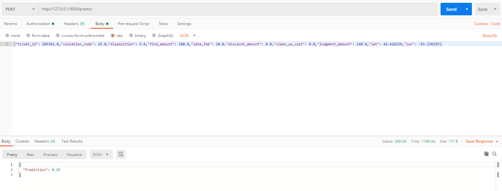

# Data Science NanoDegree Capstone Project



## Table of Contents
1. [Project Motivation](#Motivation)
2. [Getting Started](#getting_started)
	1. [Dependencies](#dependencies)
	2. [Installing](#installing)
	3. [Executing Program](#executing)
	4. [Testing](#testing)
3. [Authors & Licensing](#authors)
4. [Acknowledgement](#acknowledgement)
5. [Screenshots](#screenshots)

<a name="Motivation"></a>
## Problem Statement

This project has the motivation of helping the City of Detroit solving one of the most pressing problems facing Detroit - blight.
Blight violations are issued by the city to individuals who allow their properties to remain in a deteriorated condition. 
Every year, the city of Detroit issues millions of dollars in fines to residents and every year, many of these fines remain unpaid. 
Enforcing unpaid blight fines is a costly and tedious process, so the city wants to know: how can we increase blight ticket compliance?
The first step in answering this question is understanding when and why a resident might fail to comply with a blight ticket. 
This is where predictive modeling comes in.

As the deliverable for this project, it will be an API, as Chicago can integrate their systems with this API and fight against
blight violations

## Metrics
The evaluation metric for this project is the Area Under the ROC Curve (AUC).
The result with this model was 0.789571648559 

<a name="getting_started"></a>
## Getting Started

<a name="dependencies"></a>
### Dependencies
* Python 3.5+ (I used Python 3.6.2)
* Machine Learning Libraries: NumPy, SciPy, Pandas, Sciki-Learn
* System Librarie: sys
* Binary files: pickle
* Web App: Flask

<a name="installing"></a>
### Installing
Clone this GIT repository:
```
git clone https://github.com/gabrielboehme/DSND_Capstone.git
```
<a name="executing"></a>
### Executing Program:
1. Run the following commands in the project's root directory to set up your machine learning model.
  
  `python train_model.py`

2. Run the following command in the app's directory to run your web app.

  `python app.py`

3. Go to http://0.0.0.0:5000/

Note: Fitting the model may take some hours.

<a name="testing"></a>
### Testing the Program:

1. Go to a API application like Postman

2. Choose POST Method and insert the input values for prediction:
	* 1.ticket_id
	* 2.violation_code
	* 3.disposition
	* 4.fine_amount
	* 5.late_fee
	* 6.discount_amount
	* 7.clean_up_cost
	* 8.judgment_amount
	* 9.lat
	* 10.lon
Example: 
* {"ticket_id": 285361.0,"violation_code": 25.0,"disposition": 5.0,"fine_amount": 100.0,"late_fee": 10.0,"discount_amount": 0.0,"clean_up_cost": 0.0,"judgment_amount": 140.0,"lat": 42.426239,"lon": -83.238259}
	
3.Should get a response =)
	
<a name="Author"></a>
## Authors

* [Gabriel Boehme](https://github.com/gabrielboehme/)

<a name="acknowledgement "></a>
## Acknowledgements

* [Udacity](https://www.udacity.com/) for providing such a complete Data Science Nanodegree Program
* [Detroit Open Data Portal](https://data.detroitmi.gov/) for providing the dataset to train the model.

<a name="screenshots"></a>
## Screenshots

1. This is the example used above in Postman: 


